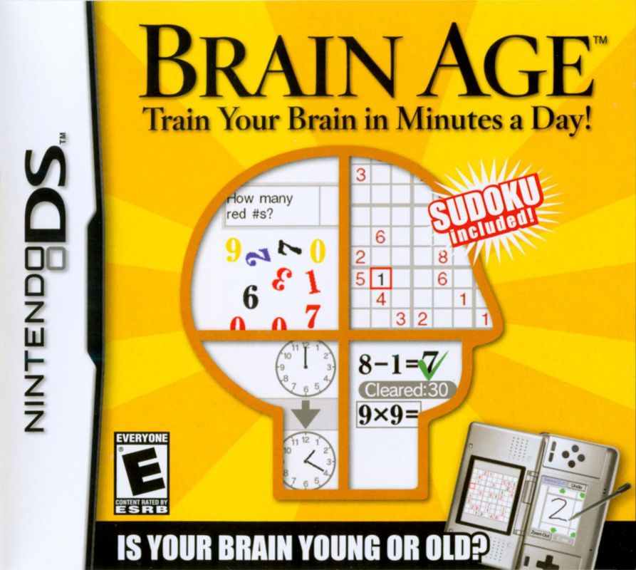
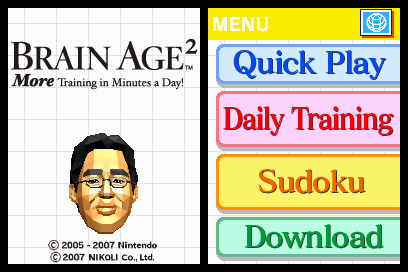
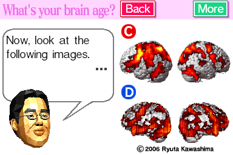

# CodeBrewCafe

## Table of Contents
- [CodeBrewCafe](#CodeBrewCafe)
- [Background](#background)
- [Site](#home)
  - [Home](#home)
  - [TicTacToe](#tictactoe)
- [Usage](#usage)
  - [Forking Repository](#forking-repository)
- [Technology](#technology)
- [Future Work](#future-work)

## Welcome to CodeBrewCafe
### Background
CodeBrewCafe is a collection of small widgets and mini-projects created during my continuous learning journey. Each widget is designed to address a specific need or curiosity, allowing me to experiment with different technologies and programming concepts.

### Overview and Goals
The main goal of CodeBrewCafe is to continuously build and expand the project, making it a tangible testament to my coding learning journey.

### Inspiration and concept
The inspiration behind the design and concept of CodeBrewCafe is based on the Brain Age game on the Nintendo DS.





The concept of having an assortment of brain training games is something I wanted to reflect in CodeBrewCafe as well as the math paper-like background and white-paper colour scheme which is inspired by Brain Age's own math-themed UI and colour design.


## Home
#### Landing Page

The landing page features a collection of many to come widgets and currently consists of the TicTacToe widget (the calculator is still a work in progress at this stage). 

Each widget has their own page and can be accessed by selecting them from the grid layout and then selecting the go button to navigate to their page.

## Widgets
### TicTacToe
#### Landing Page

The first widget I've created and added is the classic game of TicTacToe. Players take turns placing an 'X' or an 'O' until either players three adjacently in a straight line and earn a point. 

The page features the same white-paper colour scheme along with a single colour accent as part of its theme.

## Usage
### Forking repository
1. Clone the repostory
```sh
git clone https://github.com/yourusername/CodeBrewCafe.git
```
2. Navigate to the root directory:
```sh
cd CodeBrewCafe
```
2. Run the project :
```sh
npm run dev
```

## Technology
- HTML
- CSS
- JavaScript

## Future work
### Updates for existing features:
- The pages are yet to implement a comprehensive amount of responsiveness
- TicTacToe currently does not feature a tie condition. For now players can simply use the reset button for this

### Updates for upcoming features:
- The calculator is next on the list to be created
- Deployment is also a priority so that more complex apps can be used since this mini-project does not have a backend component